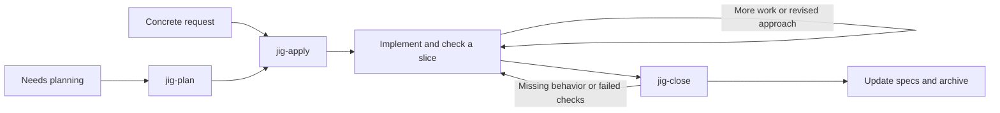

# Lean coding skills for Codex and Claude Code

A small, file-based coding workflow inspired by [OpenSpec](https://openspec.dev/): capture intent, build in verified slices, and keep the spec accurate. Three workflow actions, supporting feedback and debugging skills, one active change file. All task tracking lives in local Markdown; Git and external services are optional.

**Start with `jig-apply` and a concrete request.** It plans only as much as needed, implements, verifies, and closes the change. Use `jig-plan` separately when you want to review the approach before coding.

## Included skills

| Skill | What it does | When to use it | Result |
| --- | --- | --- | --- |
| [jig-plan](skills/jig-plan/SKILL.md) | Investigates the code and captures scope, behavior scenarios, implementation approach, and verifiable tasks. | You want to settle or review an approach before implementation. | A small local change record, or a chat plan for a trivial fix. Planning-only requests stop here. |
| [jig-apply](skills/jig-apply/SKILL.md) | Plans as needed, implements in checked slices, records progress, and continues through closeout. Manages context and execution handoffs when supported and worthwhile. | You want to build a feature, fix a bug, or resume an existing plan. | Verified code and updated specs/archive when complete; a resumable record when blocked or paused. |
| [jig-close](skills/jig-close/SKILL.md) | Verifies implementation against requirements, reconciles affected specs, and archives completed work. Also supports verification-only review. | Implementation is ready for closeout, or you want an independent review of its evidence. | Updated baseline specs and an archive record, or findings explaining why the change remains active. Review-only requests leave files unchanged. |
| [jig-feedback](skills/jig-feedback/SKILL.md) | Uses the change record, relevant code, and actual checks to explain progress, findings, decisions, or a handoff. | You ask “what's done?”, “what's next?”, or need a decision or completion summary. | An evidence-based answer with useful file links; no additional report file is required. |
| [jig-debug](skills/jig-debug/SKILL.md) | Reproduces a failure, traces its cause, tests a hypothesis, and verifies an authorized correction. | A bug is unexplained, intermittent, or persists after a fix; you want diagnosis or diagnosis and repair. | Evidence-backed findings or a verified correction, with investigation notes in the existing change record when needed. |
| [jig-remote](skills/jig-remote/SKILL.md) | Runs remote commands through SSH, using a verified local tmux pane when shared visibility or interaction is useful. | You need to inspect or work on a device, watch execution, or reuse an authenticated session. | Observed command results and a reusable terminal session when needed. It is independent of the change workflow. |

## Quick start

Install the three workflow skills, `jig-feedback`, `jig-debug`, and the companion `jig-remote` skill into a project for both tools:

```bash
./install.sh --local /path/to/project
```

Then, in your coding agent's chat:

| Intent | Codex | Claude Code |
| --- | --- | --- |
| Run a change through completion | `$jig-apply Add CSV export for the filtered orders` | `/jig-apply Add CSV export for the filtered orders` |
| Plan without implementing | `$jig-plan Add CSV export for the filtered orders` | `/jig-plan Add CSV export for the filtered orders` |
| Implement or resume a plan | `$jig-apply docs/changes/add-order-export.md` | `/jig-apply docs/changes/add-order-export.md` |
| Verify, update specs, and archive | `$jig-close add-order-export` | `/jig-close add-order-export` |
| Review without changing files | `$jig-close add-order-export; verification only` | `/jig-close add-order-export; verification only` |

These are chat invocations, not shell commands. Codex's `$` skill mentions and Claude Code's slash invocations are documented in their [skill guides](https://learn.chatgpt.com/docs/build-skills) and [Claude Code skills documentation](https://code.claude.com/docs/en/skills).

### Two names for the same skill

Codex and direct Claude Code installs share one flat namespace, so the skills carry the `jig-` prefix there. Claude Code's plugin namespace already supplies it, so the distributed copies drop it:

| Installation | Invocation |
| --- | --- |
| Codex, any scope | `$jig-apply` |
| Claude Code, `install.sh` | `/jig-apply` |
| Claude Code, plugin | `/jig:apply` |

`skills/` is canonical and always prefixed. `scripts/sync-plugin.py` strips the prefix when generating `plugins/jig/`, rewriting the references between skills to match. Do not edit the generated copies.

## The workflow



These are actions you can revisit. You do not have to type all three commands.

1. **Plan the behavior.** Read the relevant code, reuse known decisions, and write concrete scenarios plus a short checklist. Ask about consequential unknowns; resolve routine implementation choices in the code. A planning-only request stops here.
2. **Apply one working slice.** Implement an observable outcome through the layers it needs, check it, and record the result. Update the same plan when the approach changes. A clear implementation request continues without repeated plan approvals.
3. **Close with evidence.** Compare requirements with code and checks, reconcile the affected baseline specs, then archive the record. Failed or unavailable required checks leave the change active with a precise next step.

A tiny fix can go straight to editing and an appropriate check, with no new record. An existing spec still gets corrected if its contract changes. Add a separate design document only when technical decisions or migration details need the space. When you request test-first development, the same implementation skill runs a red-green-refactor loop, one behavior at a time.

Completion means verified in the current project files. Committing, pushing, merging, and deploying follow the user's separate request and project rules.

## Worked example: add CSV export

Suppose an orders application needs an export of every order matching the current filters, subject to the existing access rules. Empty results should produce column headings, and commas and quotes must be escaped correctly. The paths below illustrate a new change; use the actual path the agent creates.

For the shortest route, send one request:

```text
$jig-apply Add CSV export for all orders matching the current filters.
Reuse existing access rules. Include column headings when no orders match,
and handle commas and quotes correctly. Implement and verify the change.
```

In Claude Code, replace `$jig-apply` with `/jig-apply`; for a plugin installation, use `/jig:apply`. The agent investigates, records the substantive change, implements and checks it, then closes it when the evidence supports completion.

If you want to review the plan first, use this sequence instead:

| Step | Example message in Codex | What happens |
| --- | --- | --- |
| 1. Plan | `$jig-plan Plan CSV export for all filtered orders using existing access rules, including empty results and CSV escaping. Do not implement yet.` | The agent investigates and writes a record such as `docs/changes/add-order-export.md`, with scenarios and an ordered task checklist. It stops for your review. |
| 2. Build | `$jig-apply Implement docs/changes/add-order-export.md through completion. Use an available economical implementation model when suitable.` | The agent implements and verifies the tasks. It can hand settled work to a fresh worker when the host supports it; otherwise it continues within your constraints. |
| 3. Finish | No additional command is normally needed. | After required checks pass, the agent updates `docs/specs/order-export.md` and moves the record to `docs/changes/archive/YYYY-MM-DD-add-order-export.md`. Failed or unavailable required checks leave it active with the next action recorded. |

The same sequence works in Claude Code with `/jig-plan` and `/jig-apply`, or their `/jig:` plugin equivalents.

During a pause, ask `$jig-feedback What's done and what's next for docs/changes/add-order-export.md?` for a grounded status report. To resume in a fresh conversation or the other coding tool, provide the active record to `jig-apply`; the record and current code carry the context. If implementation was deliberately stopped before closeout, invoke `jig-close` with that record when ready.

This example needs no issue tracker or repository initialization. You only invoke the steps you need; committing or publishing the result is a separate request.

## Debugging an unexpected failure

[jig-debug](skills/jig-debug/SKILL.md) is intended to activate automatically when a bug, failing check, or unexpected behavior needs diagnosis, including during ordinary coding work. You do not need to name the skill or request a separate debugging step. `jig-apply` and `jig-close` also read it directly when needed. Closeout reviews retain their read-only scope during diagnosis.

For example, suppose the CSV export works without filters but fails when a status filter is selected:

```text
Investigate why exporting orders with a status filter fails.
Unfiltered export works. Use docs/changes/add-order-export.md.
Diagnose only; do not implement a fix yet.
```

For diagnosis and repair, replace the last line with “Find and fix the cause, then verify the filtered and unfiltered cases.” Explicit invocation is optional: `$jig-debug` in Codex, `/jig-debug` in Claude Code, or `/jig:debug` with the plugin.

The agent establishes the reproduction, compares the working case, and tests a specific explanation before proposing a correction. For this example it might inspect whether the exporter receives the selected filter; that is a hypothesis to investigate, not an assumed cause. A diagnosis-only request ends with findings and the next action. An authorized fix gets checked against the original failure and relevant neighboring behavior.

Hypotheses, experiment results, and ruled-out causes stay in the existing record's Approach/Evidence, with the next experiment in Next. A later session can continue without repeating disproven fixes. Small investigations need no new document; urgent containment remains labelled as mitigation until the cause is established.

Inspired by the investigation and hypothesis-testing approach in [Superpowers systematic-debugging](https://github.com/obra/superpowers/blob/main/skills/systematic-debugging/SKILL.md), adapted to this collection's small records, scoped checks, and existing authorization. It introduces no fixed retry quota, mandatory architecture discussion, or additional runtime dependency.

If both collections are installed, the agent should select the debugging procedure from the active workflow and existing user/project preferences: `jig-debug` for this workflow, or `systematic-debugging` for Superpowers. It should not ask you to select one for every failure or run both procedures for the same investigation. Automatic discovery remains agent-driven; this guidance does not impose a host-level precedence rule between installed skills.

## Feedback grounded in the project

[jig-feedback](skills/jig-feedback/SKILL.md) supports all three actions when explaining progress, requesting a decision, or handing work over. The workflow skills read its instructions directly when needed and reuse them once loaded; this does not depend on invoking a nested skill command. Each also includes basic reporting guidance for installations without it. You do not need to invoke another step.

For a standalone request such as “what's done?”, “how's it going?”, or “what's next?”, use `$jig-feedback Summarize docs/changes/add-order-export.md` in Codex or `/jig-feedback Summarize docs/changes/add-order-export.md` in Claude Code; plugin installs use `/jig:feedback`.

It follows the existing document tree to find support for each claim:

| Question | Source |
| --- | --- |
| What are we trying to achieve? | The selected change's scope and behavior |
| What is done, blocked, or next? | Its tasks, evidence, and next action |
| What behavior is already specified? | The linked capability spec |
| What has actually been verified? | Relevant code/tests and current check results |
| Why was this choice made? | The approach or linked design document |
| What did completed work deliver? | That change's archive record |

The skill preserves the original's useful rules: ask about concrete behavior, put evidence inside the claim, show observed output before explaining it, and explain the consequences of options. These rules also apply to questions left in plans or handoffs. It distinguishes planned behavior from observed behavior, follows only relevant links, and produces no extra status document. A status-only request leaves the project files unchanged. Git and issue trackers remain unnecessary.

## No initialization step

After installing the skills, start with `jig-plan` or `jig-apply`. The agent reads existing project instructions and build/test configuration, investigates the relevant code, and creates only the files needed for the current change:

- The first substantive plan creates `docs/changes/` and its change record.
- Successful closeout creates or updates the affected capability specs and archives the record.
- Tiny fixes need no new workflow files.

No setup skill, generated project-wide instructions, Git initialization, or baseline spec inventory is required. An ordinary folder works. Existing project conventions take precedence over the default paths.

## What stays in the project

Directories appear only when needed:

```text
docs/
├── specs/
│   └── order-export.md                  # Current implemented contract
└── changes/
    ├── add-order-export.md              # Intent, scenarios, tasks, evidence, next step
    └── archive/
        └── YYYY-MM-DD-earlier-change.md  # Completed history
```

A change proposes additions, modifications, or removals to named requirements. Baseline specs describe the implemented contract in the current project files. At closeout, only verified changes are reconciled into those specs; unrelated requirements and scenarios are preserved. A pure refactor can record preserved behavior and leave the baseline unchanged.

Use an existing project convention if there is one. This workflow does not require documenting an entire legacy system before making a change. An existing local plan can supply the intent; keep one authoritative task list and enough context on disk to resume.

Here is a typical initial record, using fictional code paths and a check command that would be confirmed against the actual project:

```markdown
# Export filtered orders
Status: planned

## Why / scope
Support staff need to download the orders currently matching their filters.
Exclude background exports and new permission rules.

## Behavior
Target: docs/specs/order-export.md

### Add: Export visible orders
Export includes all matching orders the current user can access.
- Given a status filter, when exporting, then the CSV contains only matching orders.
- Given no matches, when exporting, then the CSV contains the column headings only.
- Given a field containing a comma or quote, when exporting, then it round-trips as one field.

## Approach
Reuse the filtering and authorization in src/orders/query.ts.
Add coverage alongside tests/orders/export.test.ts.

## Tasks
- [ ] Export authorized filtered rows — check: filtered and inaccessible-order cases.
- [ ] Handle empty results and CSV escaping — check: header-only and round-trip cases.

## Evidence
Planned: npm test -- tests/orders/export.test.ts (not run).

## Next
Implement the first export path using the existing order query.
```

During implementation, the agent replaces planned evidence with actual commands and outcomes. After successful closeout, the record moves to the archive and `docs/specs/order-export.md` contains the current requirements and scenarios. See the [compact template](skills/jig-plan/references/change-template.md).

### Resume or switch agents

Finish a session with the record's tasks, evidence, and next action up to date. In either tool, invoke `jig-apply` with that record's path. The next session checks the current project files and resumes from them; it does not need the full prior chat. Across machines or project copies, transfer the code changes and record together using your preferred method.

Several changes can remain active. Name the intended one when resuming. Closeout re-reads the current baseline before applying edits, so overlapping changes must be reconciled rather than overwriting each other.

## Context and model handoffs

The workflow now checkpoints context automatically and requests a fresh implementation worker when the available host tools support it and the task benefits. This happens inside `jig-apply`; there is no new command or setup document. The agent's [decision table](skills/jig-apply/SKILL.md#2-choose-context-and-executor) is in the skill body, so routine decisions do not depend on loading a reference. The [execution policy](skills/jig-apply/references/context-and-execution.md) supplies the details when a transition is needed.

### When to shed context

| Situation | Default behavior |
| --- | --- |
| Short task with useful context already loaded | Continue in the same session |
| Substantial exploration is finished and the plan is executable | Save a checkpoint; prefer a fresh implementation worker when suitable |
| Host reports context pressure, or obsolete decisions repeatedly confuse the task | Save a checkpoint; compact for continuity or start fresh from the record when supported |
| A meaningful slice finishes or execution pauses | Update tasks, evidence, and Next so the work survives context loss |
| The same implementation failure repeats | Revisit the approach or escalate; clearing context alone will not fix it |

The checkpoint uses the existing record: decisions and constraints, relevant paths, completed/pending work, actual check results, and the next bounded action. There is no duplicated handoff file. Any active worker/process must be accounted for before another agent resumes editing.

**Compaction, a fresh conversation, and a model switch are different.** Compaction preserves a summary of history. A fresh worker starts without the planning conversation but still needs project instructions and the selected files. Switching models by itself does not clear history. A conversation fork or resumed worker can retain history.

### Who does the implementation?

For a self-contained, verifiable task, the default preference is:

```text
Planning agent → compact work order → economical worker with fresh task history
       ↑                                  ↓
       └──── inspect results, verify, and close locally
```

The worker receives the record and relevant file paths, editable scope, checks, and a stop condition. It implements its assigned slice and returns concise evidence. It does not redelegate or archive. The parent owns scope decisions, inspects the actual changes, and runs closeout. Only one implementation worker writes at a time.

Model choice follows your explicit preference, then an existing execution-model setting, then the host's available model catalogue. The skill requests a suitable economical model when one is known; it does not assume a subagent automatically uses a cheaper model. If the model or its relative cost cannot be established, it reports that limit and retains the current model. No model IDs or pricing claims are baked into the skills.

Keeping the same capable model is reasonable for small tasks, tightly coupled reasoning, or difficult work where retries and review would outweigh savings. A worker that repeats the same behavioral failure after one focused correction returns the problem to the parent. Delegation is a cost/quality tradeoff, not a guaranteed optimization.

You can steer this once in the request or existing project instructions: “Use the available economical implementation model,” “Use <model> for implementation,” or “Keep this task in the current agent.” The workflow reuses that preference and does not ask you to select a model for every slice.

### What can happen without intervention?

| Action | What the skills can do |
| --- | --- |
| Preserve a resumable checkpoint | Automatically write it into the active record during authorized implementation |
| Start an economical worker with fresh task history | Use native subagent tools when they expose the necessary context/model controls and allow delegation |
| Reset or compact the parent conversation | Use an authorized callable control if exposed; otherwise recommend the host action and supply the resume prompt |
| Change your global settings or launch a separate CLI/session | Requires a separate request; installation does not do this |

During the capability check in Codex desktop on 2026-09-07, the exposed subagent tool supported no-history spawning and model selection, while no callable parent-context reset tool was exposed. This is an observation of that environment, not a guarantee for every installation; the skill checks the actual tools before acting.

If a manual transition is needed, the agent supplies the real record path and a resume prompt such as `Use jig-apply to resume docs/changes/add-order-export.md; inspect current files and complete the next pending slice.` In the CLIs:

- **Codex:** `/compact` summarizes the current chat; `/new` starts fresh; `/model` selects the model. After starting fresh, send the resume prompt. See [Codex commands](https://learn.chatgpt.com/docs/developer-commands?surface=cli).
- **Claude Code:** `/compact` summarizes, `/clear` starts fresh, and `/model` selects the model. After clearing, send the resume prompt. See [Claude Code commands](https://code.claude.com/docs/en/commands).

These are user commands, not shell commands or actions performed by writing them in a skill. The agent recommends a manual transition only when useful; unsupported automation does not become a repeated permission loop. If clean context is explicitly required and unavailable, it checkpoints and reports the necessary action instead of silently continuing with old history.

Claude Code documents [automatic context management](https://code.claude.com/docs/en/how-claude-code-works#the-context-window) and [fresh non-fork subagents with model controls](https://code.claude.com/docs/en/sub-agents). Codex documents [delegation from skills and per-agent model configuration](https://learn.chatgpt.com/docs/agent-configuration/subagents). Keep host auto-compaction enabled; the skills add durable checkpoints and task-boundary decisions, not a replacement compaction engine.

These instructions cannot guarantee that a host exposes a particular tool, honors a requested model, or achieves lower total cost. Report actual transitions and observable model choices. The installer does not change personal model settings, compaction thresholds, or permission rules.

## What we took from OpenSpec

Research reviewed on **2026-09-07**. This is an independent distillation, not an OpenSpec distribution or a replacement implementation of its CLI.

| OpenSpec idea | Adaptation here |
| --- | --- |
| Separate current specs from proposed changes | Small capability specs plus one active change record |
| Express requirements as observable scenarios | Concrete context/action/result examples |
| Describe added, modified, and removed behavior | Named requirement changes inside the record |
| Evolve artifacts during implementation | Edit the same plan, reopen affected tasks, refresh evidence |
| Verify and reconcile before archiving | Fold verification, spec updates, and archive into `jig-close` |
| Build specs incrementally in existing projects | Document the capabilities touched by real work |

OpenSpec separates change artifacts and uses schema-defined dependencies. Its concepts of [current specs, deltas, and archives](https://github.com/Fission-AI/OpenSpec/blob/main/docs/concepts.md) informed the durable record. Its [editable artifacts](https://github.com/Fission-AI/OpenSpec/blob/main/docs/editing-changes.md) informed the iterative loop. The [default schema](https://github.com/Fission-AI/OpenSpec/blob/main/schemas/spec-driven/schema.yaml) separates observable requirements from implementation choices and ties tasks to verification.

Our deliberate simplifications are one normal change file, three entry points, integrated closeout, and a no-record path for trivial work. No schema engine, initialization step, or status service is required. Native subagents are used adaptively when available; the workflow also works without them. The tradeoff: agents maintain the Markdown by instruction; there is no deterministic schema validator or workflow engine enforcing it.

**Already using OpenSpec?** Keep its native `openspec/` layout, schema, and generated skills/tooling. These skills defer to those conventions. The compact `docs/changes/*.md` format is not CLI-compatible OpenSpec input, and installation does not migrate or initialize an OpenSpec project. Use [OpenSpec itself](https://openspec.dev/docs/installation) when its tooling and schema customization are useful.

## Keeping the workflow lean

- Keep three workflow actions, with feedback and debugging guidance loaded when needed. Load each skill body and its references only when needed.
- Each skill separates mandatory rules from numbered process steps. A little repeated record-selection and path guidance keeps each entry point usable on its own; shared-reference generation would add another layer to maintain and load.
- Read the selected change, affected specs, and relevant code; search before reading whole directories. Load supporting references only when needed.
- Keep one source for each fact: intended change in the active record, current contract in baseline specs, implementation in code.
- Record decisions and short verification results, not transcripts or full test logs. Reuse valid evidence; rerun it after relevant changes.
- Match process to uncertainty and risk. No fixed document count, exhaustive story list, test quota, or required subagents.
- Use repository instructions for project-wide facts and build commands; skills contain the reusable workflow.

These are design choices to reduce context and repeated work, not measured claims about token savings or model accuracy.

## Installation and updates

### Remote device work

[jig-remote](skills/jig-remote/SKILL.md) is a companion skill for SSH work in a local tmux pane you can watch. Use `$jig-remote Inspect disk usage on pi` in Codex or `/jig-remote Inspect disk usage on pi` in Claude Code. You can also name an existing authenticated session. One-shot checks use ordinary SSH when a shared terminal is unnecessary.

The skill verifies the target and exact pane, checks readiness before typing, and records foreground command results. It preserves your authentication settings and hands credential entry to you when needed. Watch with a read-only tmux attachment; manual input requires a writable attachment and a pause in agent input. Local tmux does not guarantee that remote jobs survive an SSH disconnect.

This skill uses local tmux; its shell protocol also needs Bash, OpenSSL, and Perl. It is independent of the spec workflow and adds no required workflow step.

### Install the collection

The installer requires Bash and standard Unix utilities (macOS, Linux, or WSL). The workflow itself is Markdown and requires no OpenSpec, Node, Python, hooks, or connectors.

```bash
# Preview the default project installation
./install.sh --local /path/to/project --dry-run

# Install globally for both tools
./install.sh --global

# Link to this checkout so edits become available without recopying
./install.sh --global --mode symlink
```

| Scope | Claude Code | Codex |
| --- | --- | --- |
| Project | `<project>/.claude/skills/` | `<project>/.agents/skills/` |
| Global | `~/.claude/skills/` | `~/.agents/skills/` |

Paths follow the official [Claude Code](https://code.claude.com/docs/en/skills#where-skills-live) and [Codex](https://learn.chatgpt.com/docs/build-skills#where-codex-loads-local-skills) skill discovery documentation.

Copy mode is the default and includes supporting references. Rerun installation after updating this checkout. Symlink mode requires the checkout to remain at the same path; use copy mode for a portable project. Restart the agent if newly installed skills do not appear.

Installation replaces destination folders with matching skill names, so preserve local edits before reinstalling. Other skill names are untouched. Previously installed standalone copies of removed skills remain until you remove those copies; reinstalling updates the six included skills. With no scope argument, the scripts offer an interactive local/global choice.

Earlier versions incorrectly installed global Codex skills under `~/.gemini/config/skills/`. Reinstall to the corrected path. The scripts leave that legacy location untouched; remove only the old copies you recognize if they are no longer needed.

### Claude Code marketplace alternative

The `jig` plugin contains the same three workflow skills, `jig-feedback`, `jig-debug`, and `jig-remote`:

```text
/plugin marketplace add JNSFilipe/jig
/plugin install jig@jig
```

Use `/jig:apply`, `/jig:plan`, and `/jig:close`. The short names above apply to direct installation. Choose one installation method per scope to avoid duplicate entries. For local plugin development, Claude Code supports `claude --plugin-dir ./plugins/jig`. See [Claude Code's plugin documentation](https://code.claude.com/docs/en/plugins). Changes in this checkout reach marketplace users after publication and update.

### Uninstall

```bash
./uninstall.sh --local /path/to/project --dry-run
./uninstall.sh --local /path/to/project
./uninstall.sh --global
```

Uninstallation removes the six included skill names; it leaves other names and project specs/change records intact. Use Claude Code's plugin management for marketplace installs.

## Maintaining this repository

`skills/` is canonical. `plugins/jig/skills/` contains standalone copies for distribution; do not edit both independently. [AGENTS.md](AGENTS.md) holds brief maintenance instructions; [CLAUDE.md](CLAUDE.md) imports them. These files apply to this collection and are not installed into consumer projects.

After editing skills:

```bash
python3 scripts/sync-plugin.py
python3 scripts/sync-plugin.py --check
python3 -m unittest discover -s tests -v
bash -n install.sh uninstall.sh
```

Python 3 is needed only for repository maintenance. Sync refuses to delete plugin-only files automatically; resolve them deliberately. For a release, edit the version only in [the plugin manifest](plugins/jig/.claude-plugin/plugin.json). Sync propagates it to the marketplace's version fields; `--check` detects both content and version drift without writing.

The test suite includes that drift check. [CI](.github/workflows/validate.yml) runs it explicitly, runs the tests with terminal dependencies installed, and checks shell syntax on pushes and pull requests. CI validates the collection; GitHub is not a dependency of the installed workflow.

Installer tests exercise copy/symlink installation, updates, dry runs, removal, and preservation of source/unrelated files in temporary projects. Global paths are checked through dry runs; tests never write to personal skill directories.

Remote protocol tests execute the documented sender and reader in an isolated local tmux server. They cover output boundaries, quoting, shell state, pipeline status, pane selection, pipe toggling/replacement, and missing completion. The `protocol-example` comments identify the examples; either backtick or tilde fences work, and extra named helpers are allowed. Tests require local tmux, Bash, OpenSSL, and Perl, plus permission to create a local socket; terminal tests skip when tools are absent and never connect to a device.

For skill behavior, try a tiny fix, a multi-step feature, a paused change resumed in the other tool, and a closeout with a failed required check. Expect respectively: no new record, one evolving record, continuation from actual files, and an active record with a blocker. File validation and installer tests cannot prove agent behavior; evaluate real sessions before treating the workflow as a reliability guarantee.

For context/handoff behavior, also exercise a ready plan with a worker available, an unavailable reset tool, a planning-only request, an explicit same-model preference, and a repeated worker failure. Expect a bounded work order with fresh task history, an honest fallback, no implementation, preference preservation, and escalation after the focused correction. These are behavioral evaluation cases; the installer tests do not exercise live model routing or context resets.
