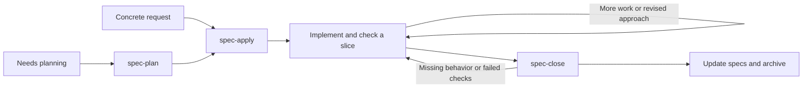

# Lean coding skills for Codex and Claude Code

A small, file-based coding workflow inspired by [OpenSpec](https://openspec.dev/): capture intent, build in verified slices, and keep the spec accurate. Three skills, one active change file. All task tracking lives in local Markdown; Git and external services are optional.

**Start with `spec-apply` and a concrete request.** It plans only as much as needed, implements, verifies, and closes the change. Use `spec-plan` separately when you want to review the approach before coding.

## Quick start

Install the three skills into a project for both tools:

```bash
./install.sh --local /path/to/project
```

Then, in your coding agent's chat:

| Intent | Codex | Claude Code |
| --- | --- | --- |
| Run a change through completion | `$spec-apply Add CSV export for the filtered orders` | `/spec-apply Add CSV export for the filtered orders` |
| Plan without implementing | `$spec-plan Add CSV export for the filtered orders` | `/spec-plan Add CSV export for the filtered orders` |
| Implement or resume a plan | `$spec-apply docs/changes/add-order-export.md` | `/spec-apply docs/changes/add-order-export.md` |
| Verify, update specs, and archive | `$spec-close add-order-export` | `/spec-close add-order-export` |
| Review without changing files | `$spec-close add-order-export; verification only` | `/spec-close add-order-export; verification only` |

These are chat invocations, not shell commands. Codex's `$` skill mentions and Claude Code's slash invocations are documented in their [skill guides](https://learn.chatgpt.com/docs/build-skills) and [Claude Code skills documentation](https://code.claude.com/docs/en/skills).

## The workflow



These are actions you can revisit. You do not have to type all three commands.

1. **Plan the behavior.** Read the relevant code, reuse known decisions, and write concrete scenarios plus a short checklist. Ask about consequential unknowns; resolve routine implementation choices in the code. A planning-only request stops here.
2. **Apply one working slice.** Implement an observable outcome through the layers it needs, check it, and record the result. Update the same plan when the approach changes. A clear implementation request continues without repeated plan approvals.
3. **Close with evidence.** Compare requirements with code and checks, reconcile the affected baseline specs, then archive the record. Failed or unavailable required checks leave the change active with a precise next step.

A tiny fix can go straight to editing and an appropriate check, with no new record. An existing spec still gets corrected if its contract changes. Add a separate design document only when technical decisions or migration details need the space. When you request test-first development, the same implementation skill runs a red-green-refactor loop, one behavior at a time.

Completion means verified in the current project files. Committing, pushing, merging, and deploying follow the user's separate request and project rules.

## No initialization step

After installing the skills, start with `spec-plan` or `spec-apply`. The agent reads existing project instructions and build/test configuration, investigates the relevant code, and creates only the files needed for the current change:

- The first substantive plan creates `docs/changes/` and its change record.
- Successful closeout creates or updates the affected capability specs and archives the record.
- Tiny fixes need no new workflow files.

No setup skill, generated project-wide instructions, Git initialization, or baseline spec inventory is required. An ordinary folder works. Existing project conventions take precedence over the default paths.

## What stays in the project

Directories appear only when needed:

```text
docs/
├── specs/
│   └── order-export.md                  # Current implemented contract
└── changes/
    ├── add-order-export.md              # Intent, scenarios, tasks, evidence, next step
    └── archive/
        └── YYYY-MM-DD-earlier-change.md  # Completed history
```

A change proposes additions, modifications, or removals to named requirements. Baseline specs describe the implemented contract in the current project files. At closeout, only verified changes are reconciled into those specs; unrelated requirements and scenarios are preserved. A pure refactor can record preserved behavior and leave the baseline unchanged.

Use an existing project convention if there is one. This workflow does not require documenting an entire legacy system before making a change. An existing local plan can supply the intent; keep one authoritative task list and enough context on disk to resume.

Here is a typical initial record, using fictional code paths and a check command that would be confirmed against the actual project:

```markdown
# Export filtered orders
Status: planned

## Why / scope
Support staff need to download the orders currently matching their filters.
Exclude background exports and new permission rules.

## Behavior
Target: docs/specs/order-export.md

### Add: Export visible orders
Export includes all matching orders the current user can access.
- Given a status filter, when exporting, then the CSV contains only matching orders.
- Given no matches, when exporting, then the CSV contains the column headings only.
- Given a field containing a comma or quote, when exporting, then it round-trips as one field.

## Approach
Reuse the filtering and authorization in src/orders/query.ts.
Add coverage alongside tests/orders/export.test.ts.

## Tasks
- [ ] Export authorized filtered rows — check: filtered and inaccessible-order cases.
- [ ] Handle empty results and CSV escaping — check: header-only and round-trip cases.

## Evidence
Planned: npm test -- tests/orders/export.test.ts (not run).

## Next
Implement the first export path using the existing order query.
```

During implementation, the agent replaces planned evidence with actual commands and outcomes. After successful closeout, the record moves to the archive and `docs/specs/order-export.md` contains the current requirements and scenarios. See the [compact template](skills/spec-plan/references/change-template.md).

### Resume or switch agents

Finish a session with the record's tasks, evidence, and next action up to date. In either tool, invoke `spec-apply` with that record's path. The next session checks the current project files and resumes from them; it does not need the full prior chat. Across machines or project copies, transfer the code changes and record together using your preferred method.

Several changes can remain active. Name the intended one when resuming. Closeout re-reads the current baseline before applying edits, so overlapping changes must be reconciled rather than overwriting each other.

## What we took from OpenSpec

Research reviewed on **2026-09-07**. This is an independent distillation, not an OpenSpec distribution or a replacement implementation of its CLI.

| OpenSpec idea | Adaptation here |
| --- | --- |
| Separate current specs from proposed changes | Small capability specs plus one active change record |
| Express requirements as observable scenarios | Concrete context/action/result examples |
| Describe added, modified, and removed behavior | Named requirement changes inside the record |
| Evolve artifacts during implementation | Edit the same plan, reopen affected tasks, refresh evidence |
| Verify and reconcile before archiving | Fold verification, spec updates, and archive into `spec-close` |
| Build specs incrementally in existing projects | Document the capabilities touched by real work |

OpenSpec separates change artifacts and uses schema-defined dependencies. Its concepts of [current specs, deltas, and archives](https://github.com/Fission-AI/OpenSpec/blob/main/docs/concepts.md) informed the durable record. Its [editable artifacts](https://github.com/Fission-AI/OpenSpec/blob/main/docs/editing-changes.md) informed the iterative loop. The [default schema](https://github.com/Fission-AI/OpenSpec/blob/main/schemas/spec-driven/schema.yaml) separates observable requirements from implementation choices and ties tasks to verification.

Our deliberate simplifications are one normal change file, three entry points, integrated closeout, and a no-record path for trivial work. No schema engine, initialization step, status service, or automatic agent delegation is required. The tradeoff: agents maintain the Markdown by instruction; there is no deterministic schema validator or workflow engine enforcing it.

**Already using OpenSpec?** Keep its native `openspec/` layout, schema, and generated skills/tooling. These skills defer to those conventions. The compact `docs/changes/*.md` format is not CLI-compatible OpenSpec input, and installation does not migrate or initialize an OpenSpec project. Use [OpenSpec itself](https://openspec.dev/docs/installation) when its tooling and schema customization are useful.

## Keeping the workflow lean

- Keep just the three workflow skills. Load each skill body and its references only when needed.
- Read the selected change, affected specs, and relevant code; search before reading whole directories. Load supporting references only when needed.
- Keep one source for each fact: intended change in the active record, current contract in baseline specs, implementation in code.
- Record decisions and short verification results, not transcripts or full test logs. Reuse valid evidence; rerun it after relevant changes.
- Match process to uncertainty and risk. No fixed document count, exhaustive story list, test quota, or required subagents.
- Use repository instructions for project-wide facts and build commands; skills contain the reusable workflow.

These are design choices to reduce context and repeated work, not measured claims about token savings or model accuracy.

## Installation and updates

The installer requires Bash and standard Unix utilities (macOS, Linux, or WSL). The workflow itself is Markdown and requires no OpenSpec, Node, Python, hooks, or connectors.

```bash
# Preview the default project installation
./install.sh --local /path/to/project --dry-run

# Install globally for both tools
./install.sh --global

# Link to this checkout so edits become available without recopying
./install.sh --global --mode symlink
```

| Scope | Claude Code | Codex |
| --- | --- | --- |
| Project | `<project>/.claude/skills/` | `<project>/.agents/skills/` |
| Global | `~/.claude/skills/` | `~/.agents/skills/` |

Paths follow the official [Claude Code](https://code.claude.com/docs/en/skills#where-skills-live) and [Codex](https://learn.chatgpt.com/docs/build-skills#where-codex-loads-local-skills) skill discovery documentation.

Copy mode is the default and includes supporting references. Rerun installation after updating this checkout. Symlink mode requires the checkout to remain at the same path; use copy mode for a portable project. Restart the agent if newly installed skills do not appear.

Installation replaces destination folders with matching workflow skill names, so preserve local edits before reinstalling. Unrelated skill names are untouched. The former optional skills have been removed from this collection. Previously installed standalone copies remain until you remove those copies; reinstalling updates only the three workflow skills. With no scope argument, the scripts offer an interactive local/global choice.

Earlier versions incorrectly installed global Codex skills under `~/.gemini/config/skills/`. Reinstall to the corrected path. The scripts leave that legacy location untouched; remove only the old copies you recognize if they are no longer needed.

### Claude Code marketplace alternative

The `dev-skills` plugin contains the same three workflow skills:

```text
/plugin marketplace add JNSFilipe/skills
/plugin install dev-skills@jnsfilipe-skills
```

Use `/dev-skills:spec-apply`, `/dev-skills:spec-plan`, and `/dev-skills:spec-close`. The short names above apply to direct installation. Choose one installation method per scope to avoid duplicate entries. For local plugin development, Claude Code supports `claude --plugin-dir ./plugins/dev-skills`. See [Claude Code's plugin documentation](https://code.claude.com/docs/en/plugins). Changes in this checkout reach marketplace users after publication and update.

### Uninstall

```bash
./uninstall.sh --local /path/to/project --dry-run
./uninstall.sh --local /path/to/project
./uninstall.sh --global
```

Uninstallation removes the three workflow skill names; it leaves other names and project specs/change records intact. Use Claude Code's plugin management for marketplace installs.

## Maintaining this repository

`skills/` is canonical. `plugins/dev-skills/skills/` contains standalone copies for distribution; do not edit both independently.

After editing skills:

```bash
python3 scripts/sync-plugin.py
python3 scripts/sync-plugin.py --check
python3 -m unittest discover -s tests -v
bash -n install.sh uninstall.sh
```

Python 3 is needed only for repository maintenance. Sync refuses to delete plugin-only files automatically; resolve them deliberately. Keep plugin and marketplace versions aligned when preparing an update.

Installer tests exercise copy/symlink installation, updates, dry runs, removal, and preservation of source/unrelated files in temporary projects. Global paths are checked through dry runs; tests never write to personal skill directories.

For skill behavior, try a tiny fix, a multi-step feature, a paused change resumed in the other tool, and a closeout with a failed required check. Expect respectively: no new record, one evolving record, continuation from actual files, and an active record with a blocker. File validation and installer tests cannot prove agent behavior; evaluate real sessions before treating the workflow as a reliability guarantee.
